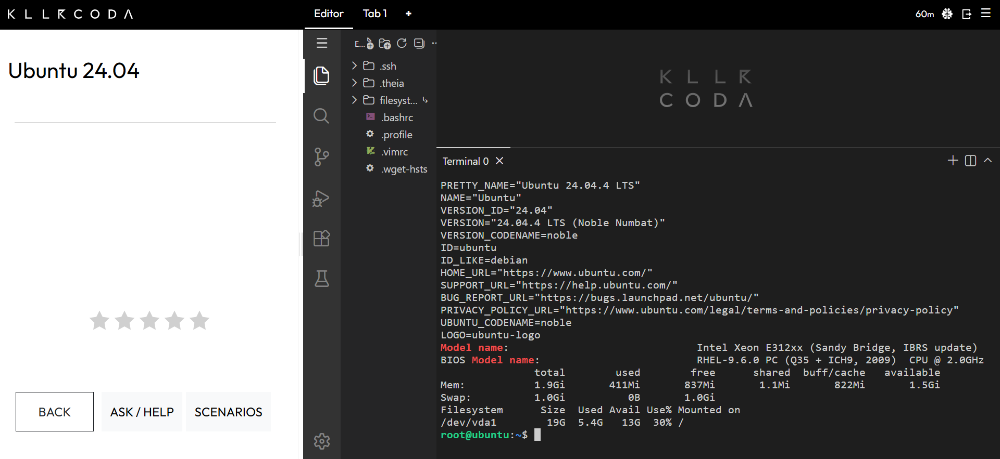

# Laboratory 3: Multi-Cloud Explorer

## Linux Server Investigation
A KillerCoda Playground Linux environment was launched to inspect system configurations and map them to cloud infrastructure alternatives[cite: 1].

### Terminal Output Evidence

### Cloud Migration Mapping
If this Linux server were migrated to public cloud environments, it can be hosted using the following equivalent virtual machine services:
1. **AWS:** **Amazon EC2** instance running Linux.
2. **Azure:** **Azure Virtual Machine** running a Linux-based image.
3. **GCP:** **Google Compute Engine (GCE)** virtual machine instance.
