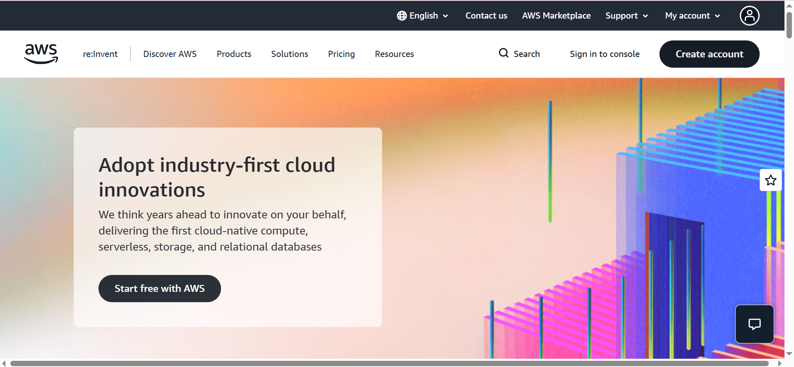

# Amazon Web Services (AWS) Research

## Brief Overview
Launched by Amazon in 2006, AWS is the pioneer and undisputed market leader in public cloud computing, offering a mature, massive ecosystem of on-demand cloud services.

## Global Infrastructure
* **Regions:** 33+ geographic regions worldwide.
* **Availability Zones (AZs):** 105+ isolated datacenters with redundant power, networking, and connectivity.
* **Edge Locations:** Hundreds of points of presence (PoPs) globally for content delivery via Amazon CloudFront.

## Cloud Management Console
AWS provides a web-based Management Console, robust Command Line Interface (CLI), and CloudShell for browser-based terminal access. Infrastructure can also be provisioned using AWS CloudFormation (Infrastructure as Code).

## Four (4) Core Services
1. **Compute:** Amazon Elastic Compute Cloud (EC2) and AWS Lambda (serverless).
2. **Storage:** Amazon Simple Storage Service (S3) and Amazon EBS.
3. **Networking:** Amazon Virtual Private Cloud (VPC) and Amazon Route 53 (DNS).
4. **Database:** Amazon Relational Database Service (RDS) and Amazon DynamoDB.

## Three (3) Advantages
1. Unmatched market maturity and extensive service catalog (200+ fully featured services).
2. Highly reliable and fault-tolerant global infrastructure.
3. Vasts community documentation, tutorials, and enterprise adoption.

## Typical Enterprise Use Cases
* Large-scale web applications and global e-commerce platforms.
* Big data processing and enterprise data lakes.
* Secure multi-tier enterprise architectures.

