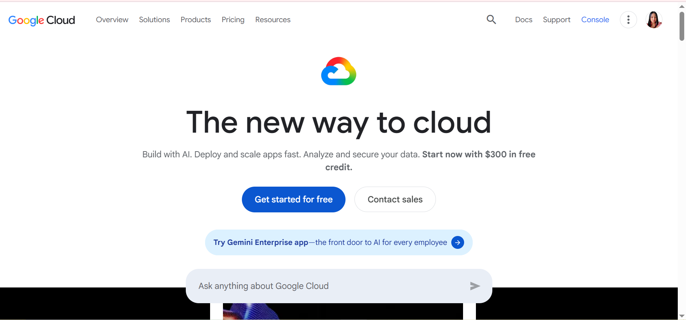

# Google Cloud Platform (GCP) Research

## Brief Overview
Launched publicly in 2008, Google Cloud Platform leverages Google's world-class internal infrastructure, data analytics engine, and containerization expertise to power modern cloud-native apps.

## Global Infrastructure
* **Regions:** 40+ regions globally connected by Google’s high-performance private fiber-optic network backbone.
* **Availability Zones:** Multi-zone and region architectures designed for high availability.
* **Edge Locations:** Global edge caching infrastructure leveraging Google's global network.

## Cloud Management Console
GCP provides the Google Cloud Console, Google Cloud CLI (`gcloud`), and Cloud Shell with built-in development tools.

## Four (4) Core Services
1. **Compute:** Google Compute Engine (GCE) and Google Kubernetes Engine (GKE).
2. **Storage:** Google Cloud Storage and Persistent Disk.
3. **Networking:** Google Virtual Private Cloud (VPC) and Cloud Load Balancing.
4. **Database:** Cloud SQL and Cloud Spanner.

## Three (3) Advantages
1. Pioneer and industry gold standard for Kubernetes container orchestration (GKE).
2. Superior performance in Artificial Intelligence, Machine Learning, and Big Data analytics (Vertex AI, BigQuery).
3. Private fiber-optic network backbone ensuring fast, secure cross-region data transfers.

## Typical Enterprise Use Cases
* Data analytics pipelines, data warehousing, and machine learning model training.
* Microservices applications deployed via Kubernetes.
* High-speed data processing and real-time streaming apps.

