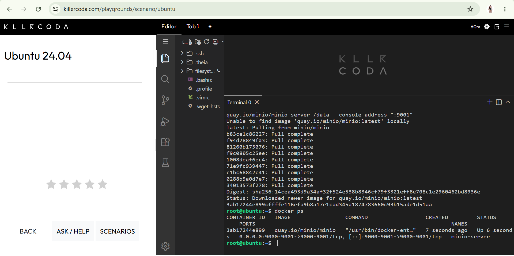
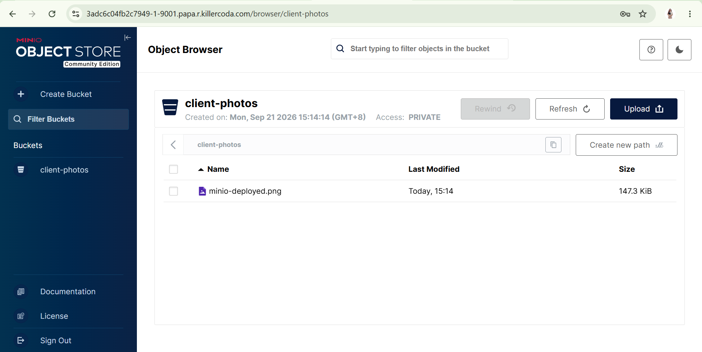

# MinIO Deployment

## Docker Command Used

```bash
docker run -d -p 9000:9000 -p 9001:9001 --name minio-server \
-e "MINIO_ROOT_USER=cloudadmin" \
-e "MINIO_ROOT_PASSWORD=CloudNova2026!" \
minio/minio server /data --console-address ":9001"
```

## Web Console Port

**9001**, accessed through KillerCoda's Traffic / Ports menu.

## Bucket Created

`client-photos`

## Explanation of the `-e` Flags

| Flag | Purpose |
|------|---------|
| `-e "MINIO_ROOT_USER=cloudadmin"` | Sets the admin username for logging into MinIO. |
| `-e "MINIO_ROOT_PASSWORD=CloudNova2026!"` | Sets the admin password for logging into MinIO. |

Environment variables let us configure the container when it starts, without modifying the image itself.

## Evidence



